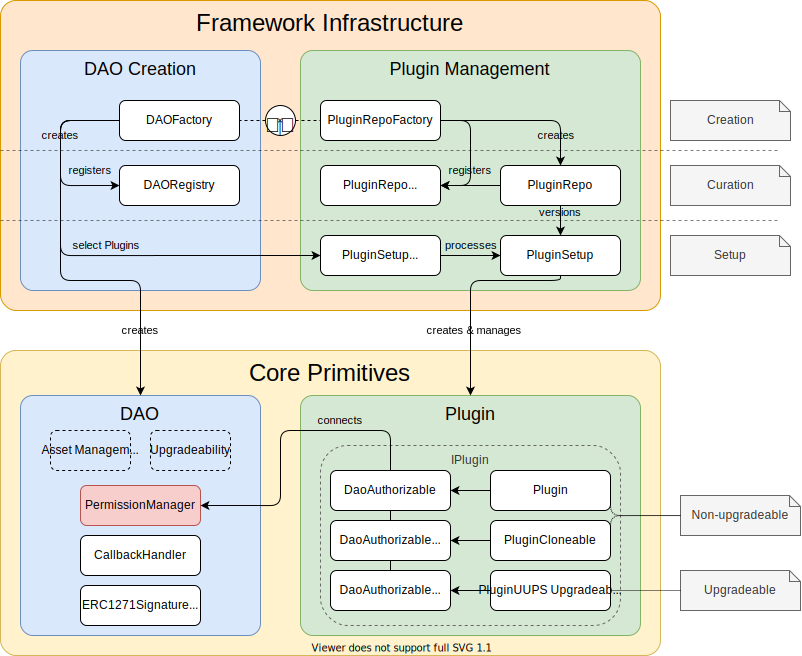

## A Categorization of the Core Contract files

:::note
Work in progress
:::

 
  Overview of the aragonOS DAO Framework with its components; the governance layer, code layer with external dependencies; and their responsibilities.

---

 
  Overview of the aragonOS DAO framework infrastructure and core primitives.

---

### Core Primitives

#### DAO Related

| Contract          | Description                                                                    | Relationship                |
| :---------------- | :----------------------------------------------------------------------------- | :-------------------------- |
| `DAO`             | The identity and basis of an organization containing the core functionalities. | registered by `DAORegistry` |
| `IDAO`            | The interface a DAO in needs to fulfill in the AragonOS framework.             | fulfilled by `DAO`          |
| `CallbackHandler` | Adds functionality that allows registering callbacks for .                     | owned by `DAO`              |

#### Permission Related

| Contract            | Description                                                                                         | Relationship                                         |
| :------------------ | :-------------------------------------------------------------------------------------------------- | :--------------------------------------------------- |
| `PermissionManager` | A permission manager (an access control list (ACL) that `DAO` and other contracts can inherit from. | owned by `DAO`                                       |
| `PermissionLib`     | A library for data types needed for the processing of permission operations.                        | used by `DAO`, `PluginSetup`, `PluginSetupProcessor` |
| `IPermissionOracle` | An interface for oracle implementations.                                                            | implementations can be used by `PermissionManager`   |

#### Plugin Related

| Contract                         | Description                                                                                                                                                      | Relationship                         |
| :------------------------------- | :--------------------------------------------------------------------------------------------------------------------------------------------------------------- | :----------------------------------- |
| `IPlugin`                        | The interface for all plugin types.                                                                                                                              |                                      |
| `Plugin`                         | Intended for non-upgradeable plugin implementations deployed via the `new` keyword.                                                                              |                                      |
| `PluginCloneable`                | Intended for non-upgradeable plugin implementations deployed via the minimal clones pattern.                                                                     |                                      |
| `PluginUUPSUpgradeable`          | Intended for upgradeable plugin implementations deployed via the UUPS pattern.                                                                                   |                                      |
| `DaoAuthorizableBase`            | Provides a `DAO` variable, setter, and meta-transaction compatible modifier for non-upgradeable contracts to authorize function calls through an associated DAO. | used by `DaoAuthorizable`            |
| `DaoAuthorizable`                | Adds a constructor to `DaoAuthorizableBase`.                                                                                                                     | used by `Plugin`                     |
| `DaoAuthorizableCloneable`       | Adds an internal initializer to `DaoAuthorizableBase`.                                                                                                           | used by `PluginCloneable`            |
| `DaoAuthorizableBaseUpgradeable` | Provides a `DAO` variable, setter, and meta-transaction compatible modifier for upgradeable contracts to authorize function calls through an associated DAO.     | used by `DaoAuthorizableUpgradeable` |
| `DaoAuthorizableUpgradeable`     | Adds an internal initializer method and storage gap to `DaoAuthorizableBaseUpgradeable`.                                                                         | used by `PluginUUPSUpgradeable`      |

### Framework Infrastructure

#### DAO Creation

| Contract      | Description                                                | Relationship |
| :------------ | :--------------------------------------------------------- | :----------- |
| `DAOFactory`  | A template to setup plugins for a DAO using our framework. | `DAO`        |
| `DAORegistry` | Registers DAOs                                             | `DAO`        |

#### Plugin Management

| Contract             | Description                                                         | Relationship                                         |
| :------------------- | :------------------------------------------------------------------ | :--------------------------------------------------- |
| `PluginSetup`        | A template to setup plugins for a DAO using our framework.          | `Plugin`, `PluginCloneable`, `PluginUUPSUpgradeable` |
| `PluginRepo`         | Versions a plugin by storing the associated `PluginSetup` contract. | versions `PluginSetup`                               |
| `PluginRepoFactory`  | Creates `PluginRepo` contracts                                      | creates `PluginRepo`                                 |
| `PluginRepoRegistry` | Registers `PluginRepo` contracts                                    | registers `PluginRepo`                               |

### Plugin Implementations

| Contract             | Description                                                                                  | Relationship                                                                    |
| :------------------- | :------------------------------------------------------------------------------------------- | :------------------------------------------------------------------------------ |
| `MerkleMinter`       | Mints `ERC-20` tokens and distributes them on merkle trees using `MerkleDistributor` clones. | is `PluginUUPSUpgradeable`, uses `MerkleDistributor`, is used by `TokenFactory` |
| `MerkleDistributor`  | Distributes claimable ERC-20 tokens via a merkle tree.                                       | is `PluginUUPSUpgradeable`                                                      |
| `MajorityVotingBase` | Contains abstract, majority voting functionality.                                            | is parent of `ERC20Voting` and `AllowlistVoting`                                |
| `ERC20Voting`        | A majority voting plugin using ERC-20 tokens for the census.                                 | inherits from `MajorityVotingBase`                                              |
| `AllowlistVoting`    | A majority voting plugin using a list of allowed addresses for the census.                   | inherits from `MajorityVotingBase`                                              |

### Utilities

#### Token Related

| Contract                 | Description                                                                                                                                                              | Relationship                                        |
| :----------------------- | :----------------------------------------------------------------------------------------------------------------------------------------------------------------------- | :-------------------------------------------------- |
| `TokenFactory`           | Creates either a `GovernanceERC20` using `MerkleMinter` or wraps an existing token with `GovernanceWrappedERC20`. It will be deprecated and split into separate plugins. | uses `GovernanceERC20` and `GovernanceWrappedERC20` |
| `GovernanceERC20`        | An ERC-20 token that can be used for voting.                                                                                                                             | used by `TokenFactory`                              |
| `GovernanceWrappedERC20` | Wraps an existing ERC-20 and allows to use it for voting.                                                                                                                | used by `TokenFactory`                              |

#### Miscellaneous

| Contract                  | Description                                                                | Relationship                                            |
| :------------------------ | :------------------------------------------------------------------------- | :------------------------------------------------------ |
| `InterfaceBasedRegistry ` | An ERC165 interface based registry for contracts.                          | used by `DAORegistry`, `PluginRepoRegistry`             |
| `TimeHelpers`             | Returns `block.number` and `block.timestamp` as `uint64` values.           | used by `MajorityVotingBase`                            |
| `Uint256Helpers`          | Converts `uint256` to `uint64`.                                            | used by`TimeHelpers`                                    |
| `auth`                    | Provides a free function to be used in the `DaoAuthorizable` base classes. | `DaoAuthorizableBase`, `DaoAuthorizableBaseUpgradeable` |
| `Proxy`                   | Provides a convenience function to create an UUPS proxy.                   | `DAOFactory`, `PluginRepoFactory`                       |
| `UncheckedMath`           | Provides convenience functions for unchecked math operations.              | ``                                                      |
